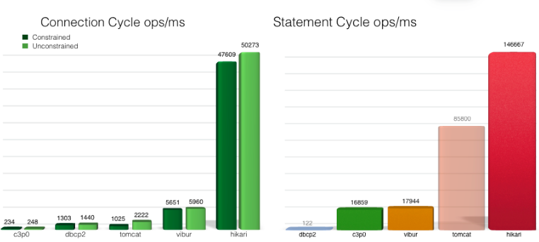
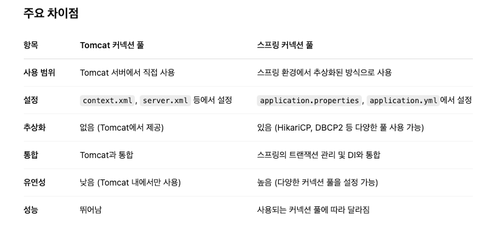

# springboot-blog
### spring boot 3 로 블로그 만들어 보기

### Thread란?
간단한 예시 )

- 프로세스 안에서 사용되는 자원

- 기본적으로 커넥터에 종속된다.
- 각 커넥터에 별도로 쓰레드를 각각 정하기 보다는, shared excuter에 정의하는 쓰레드를 상속받아서 하나의 쓰레드 풀에서 관리할 수 있게 한다.
- 기본값으로 최대 쓰레드 200개의 설정을 가지고 있다.

### Thread Dump
- 앞서 든 예시에 덧붙여 표현하자면, 길에 여러가지 종류의 차량이 다니는데 이러한 차에 대한 정보를 알려주는 역할이다.
- 실행중인 Thread의 종류와 시작점, 실행한 클래스와 메소드 순서, 현재 상태등을 기록하는 JVM의 고유 기능이다.
- 쓰레드 덤프로 서비스의 흐름과 서비스 지연시 수행중인 작업, 병목등을 확인할 수 있다.
- 쓰레드 덤프의 시작에는 쓰레드 이름과 쓰레드의 정보가 기록되며 이후 쓰레드 상태에 대해 설명해준다.
- 트레이스의 읽는 순서는 위가 최근 실행한 클래스와 메소드이기 때문에 아래서부터 위로 읽습니다.

### [Spring] DB커넥션풀과 Hikari CP 알아보기
#### JDBC란?
- **Hikari CP**(히카리 커넥션풀)을 알아보기에 앞서 JDBC의 개념을 정리하자면,
- **JDBC**는 Java Database Connectivity의 약자로 자바에서 데이터베이스에 접속할 수 있도록 하는 자바 API다.
- JDBC는 데이터베이스에서 자료를 쿼리하거나 업데이트하는 방법을 제공한다.

### DB 커넥션 풀이란
- 일반적인 데이터 연동과정은 웹 어플리케이션이 필요할 때마다 데이터베이스에 연결하여 작업하는 방식입니다.
- 하지만 이런 식으로 필요할 때마다 연동해서 작업할 경우 데이터베이스 연결에 시간이 많이 걸리는 문제가 발생합니다.

- 예를들어 거래소의 경우, 동시에 몇천명이 동시에 거래 및 조회 기능을 사용하는데 매번 데이터베이스와 커넥션을 맺고 푸는 작업을 한다면 굉장히 비효율적일 것입니다.

- 이 문제를 해결하기 위해 현재는 웹 어플리케이션이 실행됨과 동시에 연동할 데이터베이스와의 연결을 미리 설정해 둡니다.

- 그리고 필요할 때마다 미리 연결해 놓은 상태를 이용해 빠르게 데이터베이스와 연동하여 작업을 합니다.

- 이렇게 미리 데이터베이스와 연결시킨 상태를 유지하는 기술을 **커넥션 풀**
(Connection Pool, CP)라고 합니다.

### 스프링에서의 커넥션 풀
- 자바에서는 기본적으로 **DataSource 인터페이스를 사용하여 커넥션풀을 관리**한다.
- Spring에서는 사용자가 직접 커넥션을 관리할 필요없이 자동화된 기법들을 제공하는데
- SpringBoot 2.0 이전에는 tomcat-jdbc를 사용하다,
- 현재 2.0이후 부터는 **HikariCP를 기본옵션**으로 채택 하고있다.

#### 왜 Hikari Cp일까?
히카리 벤치마킹 페이지를 참고하면 아래와 같이 월등한 성능을 보인다는 것을 알 수있다.



- HikariCp가 다른 커넥션풀 관리 프레임워크보다 빠른 성능을 보여주는 이유는 커넥션풀의 관리 방법에 있다.

- 히카리는 Connection 객체를 한번 Wrappring한 **PoolEntry**로 Connection을 관리하며,
- 이를 관리하는 **ConcurrentBag**이라는 구조체를 사용하고 있다.

- **ConcurrentBag은 HikariPool.getConnection() -> ConcurrentBag.borrow()** 라는 메서드를 통해 사용 가능한(idle) Connection을 리턴하도록 되어있다.

- 이 과정에서 커넥션생성을 요청한 스레드의 정보를 저장해두고 다음에 접근시 저장된 정보를 이용해 빠르게 반환을 해준다.

- 이러한 방법 때문에 속도에 이점이 있으며 해당 방법의 자세한 설명은 아래 블로그를 참조하면 좋을 것 같다.

### Hikari CP 사용법
- build.gradle에 따로 추가할 필요 없이
- "org.springframework.boot:spring-boot-starter-jdbc"를 추가하면 자동으로 추가된다.
- 이후 application.yml에 설정값을 추가하면 되는데

```text
spring:
 datasource:
   url: jdbc:mysql://localhost:3306/world?serverTimeZone=UTC&CharacterEncoding=UTF-8
   username: root
   password: your_password
   hikari:
     maximum-pool-size: 10
     connection-timeout: 5000
     connection-init-sql: SELECT 1
     validation-timeout: 2000
     minimum-idle: 10
     idle-timeout: 600000
     max-lifetime: 1800000

server:
 port: 8000
```

### options

- maximum-pool-size: 최대 pool size (defailt 10)
- connection-timeout: (말 그대로)
- connection-init-sql: SELECT 1
- validation-timeout: 2000
- minimum-idle: 연결 풀에서 HikariCP가 유지 관리하는 최소 유휴 연결 수
- idle-timeout: 연결을위한 최대 유휴 시간
- max-lifetime: 닫힌 후 pool 에있는 connection의 최대 수명 (ms)입니다.
- auto-commit: auto commit 여부 (default true)

### DeadLock 피하기
- 이론적으로 필요한 최소한의 커넥션 풀 사이즈를 알아보면 다음과 같다.
```text
PoolSize = Tn × ( Cm -1 ) + 1

Tn : 전체 Thread 갯수
Cm : 하나의 Task에서 동시에 필요한 Connection 수
```
- 위와 같은 식으로 설정을 한다면 데드락을 피할 수는 있겠지만 여유 커넥션풀이 하나 뿐이라 성능상 좋지 못하다.
- 따라서 커넥션풀의 여유를 주기위해 아래와 같은 식을 사용하는것을 권장한다.

```text
PoolSize = Tn × ( Cm - 1 ) + ( Tn / 2 )

thread count : 16
simultaneous connection count : 2
pool size : 16 * ( 2 – 1 ) + (16 / 2) = 24
```

궁금한 한 점은 tomcat 커넥션 풀과 스프링 커넥션 풀은 어떤 점이 다른 걸까?
차이점 정리로 여기까지 안다.


### API
Application programing interface 약자로 네트워크에서 API는 프로그램 간에 상호작용하기 위한 매개체 역할
- 매개체란 ? 
- 중간에서 연결을 해준다는 뜻

### REST API
- Representational state transfer 약자로 자원을 이름으로 구분해 자원의 상태를 주고 받는 API 방식이다.

#### Rest api 특징
- 서버/클라이언트 구조 , 무상태, 캐시 처리 가능, 계층화, 인터페이스 일관성 등이 있다.

#### Rest api 장점 과 단점
- URL만 보고도 무슨 행동을 하는 API인지 명확하기 할 수 있다.
- 여기서 궁금한 점 URL 과 URI 차이 점이 뭘까?
```text
1. URI (Uniform Resource Identifier)
정의: URI는 인터넷 또는 로컬 네트워크에서 자원을 식별하기 위해 사용되는 문자 문자열입니다. URI는 자원을 식별할 수 있는 수단을 제공하지만, 그 자원을 어떻게 찾고 접근할지는 명시하지 않습니다.

목적: URI의 목적은 **자원의 고유 식별자를 제공** 하는 것입니다. 자원을 식별할 수는 있지만, 자원을 어떻게 접근할지에 대한 정보는 포함하지 않을 수 있습니다.

URI는 URL 또는 URN(Uniform Resource Name)일 수 있습니다.

URN은 자원의 이름을 특정 네임스페이스 내에서 식별하지만, 자원을 찾는 방법을 제공하지 않습니다.
URI 예시:
urn:isbn:0451450523

2. URL (Uniform Resource Locator)
정의: URL은 자원을 식별하는 것뿐만 아니라 인터넷을 통해 자원에 접근할 수 있는 방법을 제공하는 URI의 특정 유형입니다.

목적: URL은 프로토콜(스킴)(예: HTTP, HTTPS, FTP), 호스트(도메인), 그리고 때때로 자원에 대한 경로를 포함하여 클라이언트가 자원에 어떻게 접근할지 알 수 있도록 합니다.

URL은 자원과 위치를 모두 명시하며, 자원에 접근하는 방법(프로토콜, 도메인 등)을 포함합니다.

URL은 URI의 하위 집합으로, 자원에 접근할 수 있는 방법을 명시하는 추가적인 기능을 제공합니다.

URL 예시:
https://www.example.com/index.html
이 URL은 자원(웹페이지 index.html)과 접근 방법(HTTP 프로토콜을 사용하여 https://, 도메인 www.example.com)을 모두 지정

```

### **주요 차이점 :**


### **요약:**
- URI는 자원을 식별하는 문자열로, 자원을 식별할 수 있지만 반드시 접근 방법을 제공하는 것은 아닙니다.
- URL은 자원을 식별하고 위치와 접근 방법을 제공하는 URI의 한 종류입니다.
- 따라서 모든 URL은 URI이지만, 모든 URI는 URL이 아닙니다. 주요 차이점은 URL은 자원의 위치와 접근 방법을 제공하는 반면, URI는 자원 식별만을 제공할 수 있다는 점입니다.
- 상태가 없다는 특징이 있어 클라이언트와 서버의 역할이 명확하게 구분된다.

- 다시 단점으로는 http 메서드 즉 , GET,POST 와 같은 방식의 개수에 제한이 있고,
- 설계하기 위해 공식적으로 제공되는 표준 규약이 없다.
- 그럼에도 주소와 메서드만 보고 요청의 내용을 파악할 수 있는 강력한 장점이 있어 많은 개발자들이 사용한다.
- 심지어 'REST하게 디자인한 API를 RESTful API라고 부르기도 한다.'

### Rest API를 사용하는 방법

- 규칙1. URL에는 동사를 쓰지말고 명사를 사용하고, 자원을 표시해야 한다.
  - 여기서 말하는 자원은 가져오는 데이터를 말한다.
  - 동사를 사용하게되면 혼란을 줄 수가 있다.


- 규칙2. 동사는 HTTP 메서드로
  - 앞서 동사는 http 메서드라는 것으로 해결한다.
  - 이외에도 슬래시는 계층 관계를 나타내ㅡㄴ 데 사용하거나, 밑줄 대신 하이픈을 사용하거나
  - ,자원의 종류가 컬렉션인지 도큐먼트인지에 따라 단수, 복수를 나누거나 하는 등의 규칙이 있지만 지금 당장은 여기까지만 알도록 하자.

### JPA의 entity는 왜 protected로 생성자를 만들어야 하는가?
- 갑자기 궁금해졌다.
  JPA에서 엔티티 클래스에 **기본 생성자**를 **`protected`**로 만드는 이유는 JPA가 엔티티 객체를 **반사(reflection)** 방식으로 생성하기 때문입니다. JPA는 엔티티 클래스의 객체를 생성할 때, **`new`** 키워드를 사용하여 기본 생성자를 호출합니다. 그리고 이 생성자는 일반적으로 **객체를 불변 객체로 만들기 위해**, 또는 **JPA 프레임워크가 엔티티 객체를 내부적으로 다루기 위해** `protected`나 **`private`**로 설정하는 것이 관례입니다.

### 기본 생성자를 `protected`로 설정하는 이유:

1. **JPA의 내부 사용을 위한 제한**
  - JPA는 객체를 생성할 때 `new` 키워드를 통해 기본 생성자를 호출합니다. 이 때 기본 생성자는 외부에서 직접 호출되지 않도록 `protected`나 `private`로 설정하는 것이 안전합니다.
  - 엔티티 클래스의 객체는 애플리케이션의 비즈니스 로직에서 직접 `new` 키워드로 생성하는 것보다는, JPA가 관리하는 방식으로 생성되어야 하기 때문에 기본 생성자를 외부에서 호출할 수 없도록 하는 것이 좋습니다.

2. **객체 생성의 제어**
  - `protected`로 기본 생성자를 선언하면, 외부에서는 해당 생성자를 직접 호출할 수 없고, 같은 패키지 내 또는 상속받은 클래스에서만 사용할 수 있습니다. 이를 통해 객체 생성의 제어가 가능합니다. 예를 들어, 엔티티가 **불변 객체**로 설계되어야 한다면, 엔티티 객체를 애플리케이션 코드에서 직접 생성할 수 없게 제한할 수 있습니다.

3. **상속을 위한 필요성**
  - JPA는 기본 생성자를 사용하는데, 이 생성자가 `protected`로 선언되면 다른 클래스에서 상속받아서 엔티티를 사용할 때에도 문제가 되지 않습니다. 예를 들어, 엔티티가 `@Inheritance` 전략을 사용하여 상속 관계를 가지는 경우, 기본 생성자가 `protected`이면 자식 클래스에서 해당 생성자를 사용할 수 있습니다.

### 예시

```java
import javax.persistence.Entity;
import javax.persistence.Id;
import javax.persistence.GeneratedValue;
import javax.persistence.GenerationType;

@Entity
public class Product {
    
    @Id
    @GeneratedValue(strategy = GenerationType.IDENTITY)
    private Long id;
    private String name;
    
    // JPA는 기본 생성자를 호출할 때 reflection을 사용하므로, public이 아니라 protected로 설정
    protected Product() {
        // JPA의 기본 생성자
    }

    public Product(String name) {
        this.name = name;
    }

    // getters and setters
}
```

### 요약

- **`protected` 기본 생성자**: JPA가 내부적으로 객체를 생성할 때 사용하기 위한 용도로, 외부에서 객체를 임의로 생성하는 것을 방지합니다.
- **`public` 기본 생성자**: 만약 기본 생성자가 `public`으로 설정되면, JPA 외부에서 객체를 자유롭게 생성할 수 있기 때문에 엔티티 객체가 불완전하게 생성될 위험이 있습니다.

JPA의 설계 원칙상, 엔티티는 프레임워크가 제어하는 객체이므로, 기본 생성자는 `protected`로 두는 것이 가장 안전하고 권장되는 방식입니다.

### NoArgsConstructor 는 어떻게 기본 생성자를 제어하는가?
`@NoArgsConstructor` 어노테이션은 **롬복(Lombok)** 라이브러리에서 제공하는 어노테이션으로, **기본 생성자**를 자동으로 생성해주는 역할을 합니다. 이때 생성되는 기본 생성자는 **`protected`**일 수도 있고, **`public`**일 수도 있으며, 이는 `@NoArgsConstructor` 어노테이션을 사용할 때의 설정에 따라 달라집니다.

### `@NoArgsConstructor`의 기본 동작

기본적으로, `@NoArgsConstructor`는 **`public`** 접근 제어자를 가진 기본 생성자를 생성합니다. 예를 들어:

```java
import lombok.NoArgsConstructor;

@NoArgsConstructor
public class Product {
    private Long id;
    private String name;
}
```

위의 코드에서 `@NoArgsConstructor`를 사용하면, Lombok이 **`public Product()`** 기본 생성자를 자동으로 생성합니다. 즉, 이 기본 생성자는 외부에서 호출할 수 있습니다.

### `@NoArgsConstructor`의 `access` 옵션

`@NoArgsConstructor`는 `access` 속성을 제공하여 생성자의 접근 제어자를 설정할 수 있습니다. 이를 통해 기본 생성자를 `protected`로 설정할 수 있습니다.

예를 들어:

```java
import lombok.NoArgsConstructor;

@NoArgsConstructor(access = lombok.AccessLevel.PROTECTED)
public class Product {
    private Long id;
    private String name;
}
```

위와 같이 `access = lombok.AccessLevel.PROTECTED`로 설정하면, Lombok이 생성하는 기본 생성자는 **`protected`**가 됩니다. 이렇게 설정하면, JPA와 같이 **외부에서 기본 생성자를 직접 호출하지 못하게** 할 수 있습니다.

### 요약

- 기본적으로 `@NoArgsConstructor`는 **`public`** 기본 생성자를 생성합니다.
- `@NoArgsConstructor(access = lombok.AccessLevel.PROTECTED)`와 같이 설정하면, **`protected`** 기본 생성자를 생성할 수 있습니다.
- **`@NoArgsConstructor`는 Lombok에서 제공하는 기능으로, 기본 생성자를 자동으로 생성해주고, 이를 통해 코드가 더 간결해집니다.**

따라서, JPA와 같은 경우에는 기본 생성자를 `protected`로 설정하고 싶다면 `@NoArgsConstructor(access = lombok.AccessLevel.PROTECTED)`를 사용하는 것이 적합합니다.

### JpaRepository<Article, Long> 는 어떻게 동작을 하는가?
`JpaRepository<Article, Long>`는 **Spring Data JPA**에서 제공하는 **리포지토리** 인터페이스로, **JPA 엔티티**에 대한 기본적인 CRUD (Create, Read, Update, Delete) 작업을 자동으로 제공하는 역할을 합니다.

`JpaRepository`는 `Repository` 인터페이스를 확장하고, `CrudRepository`와 `PagingAndSortingRepository`를 포함한 다양한 인터페이스를 상속받습니다. 그로 인해 **기본적인 CRUD 기능**뿐만 아니라 **페이징 및 정렬 기능**도 제공하며, 엔티티 클래스와 기본 키 타입을 명시적으로 지정할 수 있습니다.

### 작동 방식

1. **제네릭 타입**: `JpaRepository<Article, Long>`
  - `Article`: JPA 엔티티 클래스의 타입입니다. 이 리포지토리는 `Article` 엔티티에 대한 CRUD 작업을 수행합니다.
  - `Long`: `Article` 엔티티의 기본 키(primary key) 타입입니다. 즉, `Article` 엔티티의 기본 키가 `Long` 타입이라는 것을 명시합니다.

2. **자동 구현**:
  - Spring Data JPA는 `JpaRepository`를 **인터페이스로 선언만 해두면** 런타임 시 자동으로 구현체를 생성하여 주입해줍니다. 따라서 개발자가 `JpaRepository`를 직접 구현할 필요가 없습니다.
  - Spring은 이 인터페이스에 정의된 메소드의 이름을 바탕으로 해당 쿼리를 자동으로 생성합니다. 예를 들어, `findById()`, `save()`, `deleteById()`와 같은 메소드들이 자동으로 구현됩니다.

3. **기본적인 CRUD 기능**:
  - `save()`: 엔티티를 저장하거나 업데이트합니다. 만약 해당 엔티티의 기본 키 값이 이미 존재하면 업데이트가 되고, 없으면 새로 저장됩니다.
  - `findById()`: 기본 키를 사용해 엔티티를 조회합니다. 기본 키가 없으면 `Optional.empty()`를 반환합니다.
  - `findAll()`: 모든 엔티티를 리스트 형태로 조회합니다.
  - `deleteById()`: 기본 키를 사용하여 엔티티를 삭제합니다.
  - `existsById()`: 주어진 ID가 존재하는지 확인합니다.

4. **페이징 및 정렬 기능**:
   `JpaRepository`는 `PagingAndSortingRepository`를 상속받기 때문에, 페이징(paging)과 정렬(sorting) 기능도 기본적으로 지원합니다.

  - 예시:
    ```java
    Page<Article> findByTitleContaining(String title, Pageable pageable);
    ```
    위 메소드는 **`title`**을 포함하는 `Article`들을 **페이지 단위**로 조회하는 기능을 제공합니다. `Pageable` 객체를 통해 페이징 및 정렬 조건을 전달할 수 있습니다.

5. **쿼리 메소드 생성**:
   Spring Data JPA는 메소드 이름을 분석하여 쿼리를 자동으로 생성할 수 있습니다. 예를 들어, `findByTitle`은 `SELECT * FROM article WHERE title = ?` 쿼리로 변환됩니다.

  - 예시:
    ```java
    List<Article> findByAuthorName(String authorName);
    ```
    위 메소드는 `authorName`이 일치하는 `Article`들을 조회하는 쿼리를 자동으로 생성합니다.

6. **JPQL 또는 네이티브 쿼리 사용**:
   기본적인 쿼리 메소드 외에도 **@Query** 어노테이션을 사용하여 **JPQL(Java Persistence Query Language)** 또는 **네이티브 SQL**을 직접 작성할 수 있습니다.

  - 예시 (JPQL):
    ```java
    @Query("SELECT a FROM Article a WHERE a.title LIKE %:title%")
    List<Article> findByTitleLike(@Param("title") String title);
    ```

  - 예시 (네이티브 SQL):
    ```java
    @Query(value = "SELECT * FROM article WHERE title LIKE %:title%", nativeQuery = true)
    List<Article> findByTitleLikeNative(@Param("title") String title);
    ```

### 예시 코드

```java
import org.springframework.data.jpa.repository.JpaRepository;
import java.util.List;

public interface ArticleRepository extends JpaRepository<Article, Long> {
    
    // 기본적으로 제공되는 메소드
    List<Article> findAll();  // 모든 Article 엔티티 조회
    
    // 사용자 정의 메소드 (title로 찾기)
    List<Article> findByTitleContaining(String title);
    
    // 페이징 및 정렬을 위한 메소드
    Page<Article> findByTitleContaining(String title, Pageable pageable);
    
    // 사용자 정의 JPQL 쿼리
    @Query("SELECT a FROM Article a WHERE a.author.name = :authorName")
    List<Article> findByAuthorName(@Param("authorName") String authorName);
}
```

### 요약

- `JpaRepository<Article, Long>`는 **`Article`** 엔티티에 대해 기본적인 CRUD 작업을 제공하는 리포지토리 인터페이스입니다.
- 메소드 이름에 따라 Spring Data JPA가 자동으로 SQL 또는 JPQL 쿼리를 생성해줍니다.
- **페이징 및 정렬**을 기본적으로 지원하며, **JPQL**이나 **네이티브 SQL**을 사용하여 복잡한 쿼리도 작성할 수 있습니다.
- Spring은 **`JpaRepository`**를 자동으로 구현하여, 개발자가 복잡한 데이터 액세스를 처리하는 데 드는 시간을 줄여줍니다.

### 여기서 나는 Spring Data JPA에 대해 궁금해졌다.
### Spring Data JPA란?

**Spring Data JPA**는 **Spring Framework**의 일부로, **Java Persistence API (JPA)**를 쉽게 사용할 수 있도록 도와주는 **추상화 레이어**를 제공합니다. **JPA**는 자바에서 객체 관계 매핑(ORM, Object-Relational Mapping)을 통해 객체와 데이터베이스 간의 상호작용을 관리하는 기술입니다. **Spring Data JPA**는 JPA를 기반으로 하여, **데이터베이스와의 상호작용**을 더 효율적이고, 간편하게 처리할 수 있도록 도와줍니다.

**Spring Data JPA**의 주요 목표는 반복적인 CRUD 작업을 쉽게 처리하고, 데이터를 다룰 때 발생할 수 있는 복잡한 작업을 간단하게 해주는 것입니다. Spring은 **자동화**된 데이터 액세스 레이어를 제공하고, 엔티티 클래스를 기반으로 기본적인 CRUD 작업을 자동으로 처리해줍니다.

### Spring Data JPA의 주요 특징

1. **Repository 추상화**:
  - Spring Data JPA는 `JpaRepository` 인터페이스를 제공하여 **엔티티**에 대해 기본적인 **CRUD** 작업을 손쉽게 할 수 있습니다.
  - `JpaRepository`는 `CrudRepository`와 `PagingAndSortingRepository`를 상속하며, CRUD 외에도 **페이징**과 **정렬** 기능을 자동으로 제공합니다.

2. **자동 구현**:
  - `JpaRepository` 인터페이스를 선언만 해두면, Spring은 런타임 시 자동으로 그 구현체를 생성하고, 의존성 주입을 통해 제공해줍니다.
  - 개발자는 `save()`, `findById()`, `delete()` 등 기본적인 CRUD 메소드만 정의하면 됩니다.

3. **쿼리 메소드**:
  - 메소드 이름만으로 쿼리 메소드를 정의할 수 있습니다. 예를 들어, `findByName` 메소드 이름은 `SELECT * FROM table WHERE name = ?`와 같은 쿼리로 변환됩니다.
  - **쿼리 메소드**는 Spring Data JPA가 자동으로 쿼리를 생성해주므로 SQL을 직접 작성할 필요가 없습니다.

4. **JPQL (Java Persistence Query Language)**:
  - **JPQL**을 사용하여 복잡한 쿼리를 작성할 수 있습니다. JPQL은 **엔티티 객체**를 대상으로 쿼리를 작성하는 객체 지향적인 쿼리 언어입니다.
  - JPQL은 SQL과 비슷하지만, **테이블** 대신 **엔티티 객체**를 대상으로 합니다.

5. **네이티브 쿼리**:
  - 복잡한 쿼리나 JPA의 제약을 벗어난 쿼리는 **네이티브 SQL**을 사용할 수 있습니다. `@Query` 어노테이션의 `nativeQuery` 속성을 `true`로 설정하면 네이티브 SQL을 실행할 수 있습니다.

6. **페이징 및 정렬**:
  - **페이징**과 **정렬**을 자동으로 지원합니다. `Pageable` 객체를 통해 데이터의 페이징 처리 및 정렬을 할 수 있습니다.

7. **트랜잭션 관리**:
  - **Spring Data JPA**는 Spring의 트랜잭션 관리 시스템을 기반으로 작동합니다. **@Transactional** 어노테이션을 통해 데이터베이스 작업을 트랜잭션으로 묶어서 처리할 수 있습니다.

### Spring Data JPA의 구성 요소

1. **Repository**:
  - Spring Data JPA는 `Repository`라는 **데이터 액세스 계층**을 제공합니다. `JpaRepository`는 `Repository` 인터페이스의 하위 인터페이스로, `CRUD`와 관련된 기본 메소드들을 제공합니다.
  - 개발자는 `JpaRepository`를 확장하여 사용자 정의 메소드를 추가할 수 있습니다.

2. **Entity**:
  - **JPA Entity**는 데이터베이스 테이블과 매핑되는 객체입니다. **`@Entity`** 어노테이션을 사용하여 JPA 엔티티로 지정하며, 이를 통해 데이터베이스 테이블과 상호작용합니다.
  - **`@Id`** 어노테이션을 사용하여 기본 키를 지정하고, **`@GeneratedValue`** 어노테이션을 사용하여 기본 키 값을 자동으로 생성할 수 있습니다.

3. **@Query**:
  - `@Query` 어노테이션을 사용하여 **JPQL** 또는 **네이티브 SQL**을 직접 작성할 수 있습니다. 복잡한 쿼리를 작성해야 할 경우 유용합니다.

   예시:
   ```java
   @Query("SELECT a FROM Article a WHERE a.title LIKE %:title%")
   List<Article> findByTitleLike(@Param("title") String title);
   ```

4. **Pageable & Sort**:
  - **`Pageable`**: 페이징을 처리하는 객체입니다. 이를 통해 원하는 페이지의 데이터를 조회할 수 있습니다.
  - **`Sort`**: 데이터를 정렬하는 객체입니다. 여러 필드를 기준으로 정렬할 수 있습니다.

   예시:
   ```java
   Page<Article> findByTitleContaining(String title, Pageable pageable);
   ```

5. **@Modifying**:
  - **`@Modifying`** 어노테이션은 `@Query`와 함께 사용하여 **데이터 수정 작업**(INSERT, UPDATE, DELETE)을 수행할 수 있게 합니다.

   예시:
   ```java
   @Modifying
   @Query("UPDATE Article a SET a.title = :title WHERE a.id = :id")
   int updateArticleTitle(@Param("id") Long id, @Param("title") String title);
   ```

### 주요 `JpaRepository` 메소드

`JpaRepository`는 `CrudRepository`의 기능을 상속받아 다양한 메소드를 제공합니다. 가장 기본적인 CRUD 메소드 외에도, **페이징**, **정렬**, **커스텀 쿼리** 등을 지원합니다.

1. **`save(S entity)`**: 엔티티를 저장하거나 업데이트합니다.
2. **`findById(ID id)`**: 주어진 ID를 사용하여 엔티티를 조회합니다.
3. **`findAll()`**: 모든 엔티티를 조회합니다.
4. **`findAll(Sort sort)`**: 주어진 정렬 조건에 맞게 모든 엔티티를 조회합니다.
5. **`findAll(Pageable pageable)`**: 페이징된 엔티티 리스트를 조회합니다.
6. **`deleteById(ID id)`**: 주어진 ID를 가진 엔티티를 삭제합니다.
7. **`count()`**: 엔티티의 총 개수를 반환합니다.

### Spring Data JPA의 장점

1. **자동화된 CRUD 작업**:
  - 복잡한 쿼리 없이 `JpaRepository`에서 제공하는 기본 메소드만으로 많은 작업을 할 수 있습니다.

2. **쿼리 메소드 자동 생성**:
  - 메소드 이름만으로 쿼리를 자동 생성하여 데이터 조회를 간단히 처리할 수 있습니다.

3. **페이징 및 정렬 지원**:
  - 데이터를 페이징 처리하고 정렬할 수 있는 기능이 기본적으로 제공됩니다.

4. **유연한 쿼리 작성**:
  - **JPQL**이나 **네이티브 쿼리**를 통해 복잡한 쿼리도 유연하게 처리할 수 있습니다.

5. **트랜잭션 관리**:
  - Spring의 트랜잭션 관리 시스템을 통해 데이터베이스의 일관성을 보장하며, **@Transactional** 어노테이션을 통해 트랜잭션 범위를 지정할 수 있습니다.

### 예시 코드

```java
import org.springframework.data.jpa.repository.JpaRepository;
import java.util.List;

public interface ArticleRepository extends JpaRepository<Article, Long> {
    
    // 기본적인 CRUD 메소드
    List<Article> findAll(); // 모든 Article 조회
    
    // 사용자 정의 메소드 (title로 찾기)
    List<Article> findByTitleContaining(String title); // 제목에 특정 문자열이 포함된 Article 조회
    
    // 페이징 및 정렬을 위한 메소드
    Page<Article> findByAuthorName(String authorName, Pageable pageable);
    
    // 사용자 정의 JPQL 쿼리
    @Query("SELECT a FROM Article a WHERE a.title LIKE %:title%")
    List<Article> findByTitleLike(@Param("title") String title);
    
    // 데이터 수정 (UPDATE)
    @Modifying
    @Query("UPDATE Article a SET a.title = :title WHERE a.id = :id")
    int updateArticleTitle(@Param("id") Long id, @Param("title") String title);
}
```

### 요약

- **Spring Data JPA**는 JPA를 쉽게 사용할 수 있도록 추상화된 **데이터 액세스 계층**을 제공합니다.
- `JpaRepository` 인터페이스를 통해 기본적인 CRUD 작업을 자동으로 처리할 수 있습니다.
- **쿼리 메소드**, **JPQL**, **네이티브 SQL** 등을 사용하여 복잡한 데이터베이스 작업을 손쉽게 처리할 수 있습니다.
- **페이징**과 **정렬**을 기본적으로 지원하며, **트랜잭션 관리**를 자동으로 처리
- Spring Data JPA 덕분에 **EntityManager**나 em.persist() 없이도 JPA를 편리하게 사용할 수 있다.