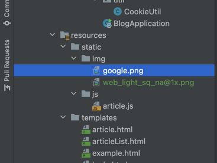

## 3.6 OAuth 뷰 구성하기
- 모든 비지니스 로직이 완성되었으므로 마지막 OAuth의 뷰를 구성한다.

### 01 단계
- controller 패키지의 UserViewController.java 파일을 연 다음 login() 메서드의 뷰를 oauthLogin으로 변경한다.
```java
// UserViewController.java
@Controller
public class UserViewController {
    @GetMapping("/login")
    public String login() {
        return "oauthLogin";
    }
}
```

### 02 단계
- 로그인 화면에서 사용할 이미지를 구글 로그인 브랜드 페이지에서 다운로드 한다.
- https://developers.google.com/identity/branding-guidelines#other-guidelines
- 

### 03 단계
- 압축 파일을 해제하고 web/3x/web_dark_sq_na@3x.png 파일을 복사한다.

- 

### 04 단계
- /resources/static/img 디렉토리를 만들고 복사한 파일을 붙여 넣는다. 그런 다음 파일명을 google.png로 변경한다.
- 

### 05 단계 
- 이제 이미지를 활용해서 로그인 화면에 OAuth 연결 버튼을 생성해 보도록 하자.
- templates 디렉토리에 oauthLogin.html 파일을 생성한 다음 코드를 입력한다.
```html
<!DOCTYPE html>
<html lang="en">
<head>
    <meta charset="UTF-8">
    <title>Title</title>
    <link rel="stylesheet" href="https://cdn.jsdelivr.net/npm/bootstrap@4.6.1/dist/css/bootstrap.min.css">

    <style>
        .gradient-custom {
            background: #6a11cb;
            background: -webkit-linear-gradient(to right, rgba(106, 17, 203, 1), rgba(37, 117, 252, 1));
            background: linear-gradient(to right, rgba(106, 17, 203, 1), rgba(37, 117, 252, 1))
        }
    </style>
</head>
<body class="gradient-custom">
<section class="d-flex vh-100">
    <div class="container-fluid row justify-content-center align-content-center">
        <div class="card bg-dark" style="border-radius: 1rem;">
            <div class="card-body p-5 text-center">
                <h2 class="text-white">LOGIN</h2>
                <p class="text-white-50 mt-2 mb-5">서비스 사용을 위해 로그인을 해주세요!</p>

                <div class = "mb-2">
                    <a href="/oauth2/authorization/google">
                        
                    </a>
                </div>
            </div>
        </div>
    </div>
</section>
</body>
</html>
```

### 06 단계
- 이제 HTML 파일과 연결할 자바스크립트 파일을 만든다. 
- resource/js 디렉토리에 token.js 파일을 만들어 다음과 같이 작성한다
- 이 코드는 파라미터로 받은 토킨이 있다면 토큰을 로컬 스토리지에 저장한다.
```js
const token = searchParam('token')

if(token) {
    localStorage.setItem("access_token", token)
}

function searchParam(key) {
    return new URLSearchParams(location.search).get(key);
}
```

### 07 단계
- articleList.html 에서 token.js를 가져올 수 있도록 파일을 수정한다.
```js
... 생략 ...
<script src ="/js/token.js"> </script>
<script src ="/js/article.js"> </script>
```

### 08 단계 
- 이어서 resource/js 패키지에 있는 article.js 파일을 열어 기존 createButton 관련 코드를 수정한다.
- 이 수정을 마치면 토큰 기반 요청을 사용한다. 
```js

// 생성 기능
const createButton = document.getElementById('create-btn');

if (createButton) {
    // 등록 버튼을 클릭하면 /api/articles로 요청을 보낸다
    createButton.addEventListener('click', event => {
        body = JSON.stringify({
            title: document.getElementById('title').value,
            content: document.getElementById('content').value
        });
        function success() {
            alert('등록 완료되었습니다.');
            location.replace('/articles');
        };
        function fail() {
            alert('등록 실패했습니다.');
            location.replace('/articles');
        };

        httpRequest('POST','/api/articles', body, success, fail)
    });
}


// 쿠키를 가져오는 함수
function getCookie(key) {
    var result = null;
    var cookie = document.cookie.split(';');
    cookie.some(function (item) {
        item = item.replace(' ', '');

        var dic = item.split('=');

        if (key === dic[0]) {
            result = dic[1];
            return true;
        }
    });

    return result;
}

// HTTP 요청을 보내는 함수
function httpRequest(method, url, body, success, fail) {
    fetch(url, {
        method: method,
        headers: { // 로컬 스토리지에서 액세스 토큰 값을 가져와 헤더에 추가
            Authorization: 'Bearer ' + localStorage.getItem('access_token'),
            'Content-Type': 'application/json',
        },
        body: body,
    }).then(response => {
        if (response.status === 200 || response.status === 201) {
            return success();
        }
        const refresh_token = getCookie('refresh_token');
        if (response.status === 401 && refresh_token) {
            fetch('/api/token', {
                method: 'POST',
                headers: {
                    Authorization: 'Bearer ' + localStorage.getItem('access_token'),
                    'Content-Type': 'application/json',
                },
                body: JSON.stringify({
                    refreshToken: getCookie('refresh_token'),
                }),
            })
                .then(res => {
                    if (res.ok) {
                        return res.json();
                    }
                })
                .then(result => { // 재발급이 성공하면 로컬 스토리지값을 새로운 액세스 토큰으로 교체
                    localStorage.setItem('access_token', result.accessToken);
                    httpRequest(method, url, body, success, fail);
                })
                .catch(error => fail());
        } else {
            return fail();
        }
    });
}
```

- 이 코드는 POST 요청을 보낼 때 액세스 토큰도 함께 보낸다. 만약 응답에 권한이 없다는 에러코드가 발생하면 리프레시 토큰과 함께 새로운 액세스 토큰을 요청하고,
- 전달 받은 액세스 토큰으로 다시 API를  요청한다.
```js
// 삭제 기능
const deleteButton = document.getElementById('delete-btn');

if (deleteButton) {
    deleteButton.addEventListener('click', event => {
        let id = document.getElementById('article-id').value;
        function success() {
            alert('삭제가 완료되었습니다.');
            location.replace('/articles');
        }

        function fail() {
            alert('삭제 실패했습니다.');
            location.replace('/articles');
        }

        httpRequest('DELETE',`/api/articles/${id}`, null, success, fail);
    });
}

// 수정 기능
const modifyButton = document.getElementById('modify-btn');

if (modifyButton) {
    modifyButton.addEventListener('click', event => {
        let params = new URLSearchParams(location.search);
        let id = params.get('id');

        body = JSON.stringify({
            title: document.getElementById('title').value,
            content: document.getElementById('content').value
        })

        function success() {
            alert('수정 완료되었습니다.');
            location.replace(`/articles/${id}`);
        }

        function fail() {
            alert('수정 실패했습니다.');
            location.replace(`/articles/${id}`);
        }

        httpRequest('PUT',`/api/articles/${id}`, body, success, fail);
    });
}
... 생략 ...

```

## 3.7 글 수정, 삭제, 글쓴이 확인 로직 추가하기
- 이제 글을 수정하거나 삭제할 때 요청 헤더에 토큰을 전달하므로 사용자 자신이 작성한 글인지 검증할 수 있다.
- 따라서 본인 글이 아닌데 수정, 삭제를 시도하는 경우에 예외를 발생시키도록 코드를 수정하도록 하자.

### 01 단계 
- BlogService.java 파일을 연 다음 코드를 수정한다.
```java
package com.springboot.blog.service;

import com.springboot.blog.domain.Article;
import com.springboot.blog.dto.AddArticleRequest;
import com.springboot.blog.dto.UpdateArticleRequest;
import com.springboot.blog.repository.BlogRepository;
import lombok.RequiredArgsConstructor;
import org.springframework.security.core.context.SecurityContextHolder;
import org.springframework.stereotype.Service;
import org.springframework.transaction.annotation.Transactional;

import java.util.List;

// RequiredArgsConstructor 빈을 생성자로 생성하는 롬복에서 지원하는 애너테이션입니다.
@RequiredArgsConstructor // final이 붙거나 @NotNull이 붙은 필드의 생성자 추가
@Service // 빈으로 서블릿 컨테이너에 등록
public class BlogService {

    private final BlogRepository blogRepository;

    ... 생략 ...
    
    public void  delete(Long id) {
        Article article = blogRepository.findById(id)
                    .orElseThrow(() -> new IllegalArgumentException("not found : " + id));
        
        authorizationArticleAuthor(article);
        blogRepository.delete(article);
    }

    @Transactional
    public Article update(Long id , UpdateArticleRequest request) {
        Article article = blogRepository.findById(id)
                .orElseThrow(() -> new IllegalArgumentException("not found :" + id));
        
        authorizationArticleAuthor(article);
        article.update(request.getTitle(), request.getContent());
        
        return article;
    }
    // 게시글 작성한 유저인지 확인
    private void authorizationArticleAuthor(Article article) {
        String userName = SecurityContextHolder.getContext().getAuthentication().getName();
        if (!article.getAuthor().equals(userName)) {
            throw new IllegalArgumentException("not authorization");
        }
    }
    
}

```
- 수정, 삭제 메서드는 작업을 수정하기 전 authorizationArticleAuthor() 메서드를 실행해 현재 인증 객체에 담겨 있는 사용자의 정보와 글을 작성한 사용자의 정보를 비교 한다.
- 만약 서로 다르면 예외를 발생 시켜 작업을 수행하지 않는다.
