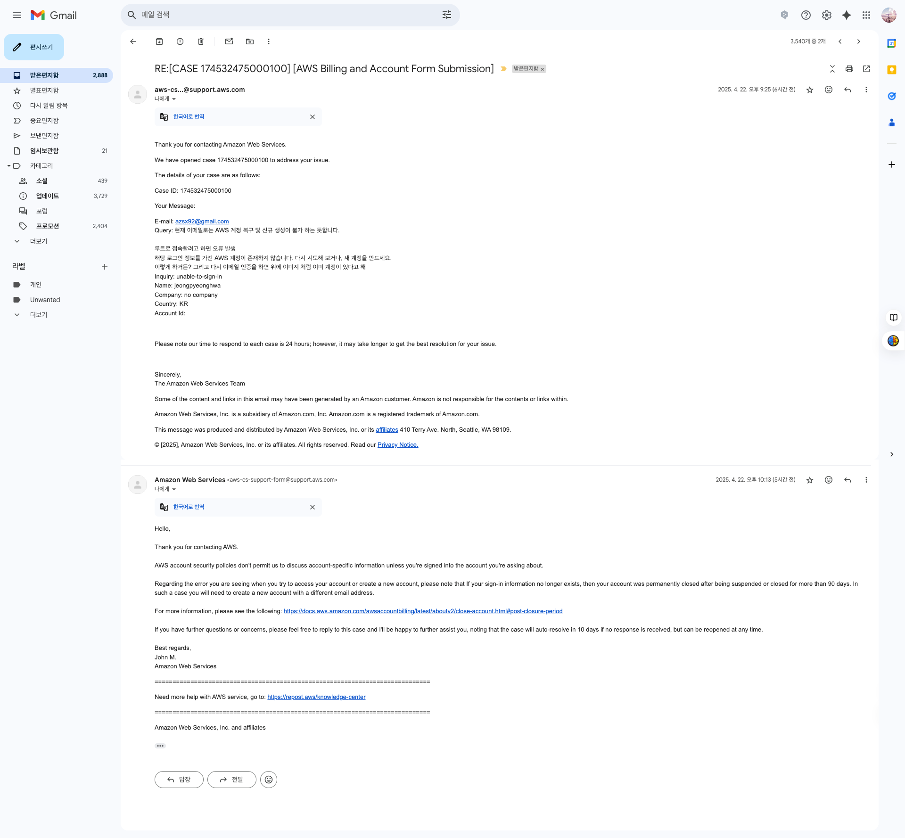

# email+aws@domain.com 라고 하면

azsx92@gmail.com이 문제의 등록된 이메일인데 이걸 azsx92aws@gmail.com 이런식으로 등록이 가능하다는 거야?

질문하신 내용 정리해서 답변드립니다.

---

## Gmail 주소에서 `+` 태그 사용 방법

- **azsx92@gmail.com**이 기존에 AWS에 등록된 이메일이라면,
**azsx92aws@gmail.com**처럼 단순히 글자를 추가하는 것은 *새로운 이메일 주소*입니다.
이 경우, Gmail에서는 azsx92aws@gmail.com과 azsx92@gmail.com을 **서로 다른 주소로 인식**합니다.
- **Gmail의 + 태그 기능**을 사용하면,
예를 들어 **azsx92+aws@gmail.com**처럼 `+` 뒤에 원하는 문자를 붙여서 가입할 수 있습니다.
이때, AWS는 **azsx92+aws@gmail.com**을 별도의 이메일로 인식하지만,
실제 메일은 모두 **azsx92@gmail.com**으로 수신됩니다[^7].

---

## 정리

| 입력한 이메일 | AWS에서 인식 | 실제 메일 수신함 |
| :-- | :-- | :-- |
| azsx92@gmail.com | 별도 계정 | azsx92@gmail.com |
| azsx92+aws@gmail.com | 별도 계정 | azsx92@gmail.com |
| azsx92aws@gmail.com | 별도 계정 | azsx92aws@gmail.com |

- **azsx92+aws@gmail.com**처럼 `+`를 활용하면, 실제 메일은 기존 메일함(azsx92@gmail.com)에서 확인할 수 있습니다.
- **azsx92aws@gmail.com**처럼 `+` 없이 글자를 추가하면, 그 주소가 실제로 존재해야 하고, 해당 메일함에서만 메일을 받을 수 있습니다.

---

## 추천

- **새로운 AWS 계정 생성 시**
→ `azsx92+aws@gmail.com`처럼 `+` 태그를 붙여서 가입하면,
→ 인증 메일 등 모든 메일은 기존 메일함(azsx92@gmail.com)에서 받을 수 있습니다[^7].

---

## 참고

- 이 방법은 Gmail에서만 지원됩니다.
- AWS는 `+`가 붙은 이메일을 별도의 계정으로 인식합니다.

---

**즉, azsx92+aws@gmail.com 으로 가입하면 기존 메일함에서 메일을 받을 수 있고, AWS에서는 새로운 계정으로 인식합니다.**
azsx92aws@gmail.com은 완전히 별개의 이메일 주소이므로, 그 주소를 실제로 소유하고 있어야만 사용 가능합니다.

위에 처럼 이메일이 왔다.

⁂

[^1]: https://pplx-res.cloudinary.com/image/private/user_uploads/vhhqwyPtepmmhUu/seukeurinsyas-2025-04-22-ohu-9.08.14.jpg

[^2]: https://pplx-res.cloudinary.com/image/private/user_uploads/JGXEeJIkIgiHWkV/image.jpg

[^3]: https://pplx-res.cloudinary.com/image/private/user_uploads/rRvdtAGgVUEAXRV/image.jpg

[^4]: https://www.reddit.com/r/aws/comments/1gt09zj/can_using_email_aliases_for_aws_accounts_raise/

[^5]: https://accendnetworks.com/2024/09/25/using-an-alias-for-your-aws-account-id/

[^6]: https://www.reddit.com/r/aws/comments/7vy2pg/somebody_signed_up_for_an_aws_account_with_my/

[^7]: https://www.dpoindexter.com/garden/aws-accounts-emails/

[^8]: https://docs.aws.amazon.com/ses/latest/dg/creating-identities.html

[^9]: https://docs.aws.amazon.com/prescriptive-guidance/latest/patterns/register-multiple-aws-accounts-with-a-single-email-address-by-using-amazon-ses.html

[^10]: https://getstarted.awsworkshop.io/01-up-front-tasks/04-address-prereqs/02-obtain-email-addresses.html

[^11]: https://repost.aws/questions/QUXyu5jmhWTlm0Pz6Y8v1Smg/how-to-change-my-email-account

[^12]: https://support.google.com/a/thread/82195370/how-can-i-set-up-a-catch-all-email-for-domain-alias-hosted-on-aws-registrar-google-domains

[^13]: https://docs.aws.amazon.com/IAM/latest/UserGuide/console-account-alias.html

[^14]: https://dev.to/ulzahk/how-to-setup-your-business-email-with-amazon-workmail-and-gmail-3m64

[^15]: https://stackoverflow.com/questions/63208682/create-an-alias-for-a-google-service-account-email

[^16]: https://docs.aws.amazon.com/accounts/latest/reference/manage-acct-alias.html

[^17]: https://docs.aws.amazon.com/kendra/latest/dg/data-source-gmail.html

[^18]: https://bdolgov.blog/b/custom-email-domain-using-gmail/

[^19]: https://repost.aws/questions/QU0ztdHEIpQzyE1x9bFZsqGg/can-t-find-account-id-account-alias

[^20]: https://aws.amazon.com/blogs/machine-learning/discover-insights-from-gmail-using-the-gmail-connector-for-amazon-q-business/

[^21]: https://www.businesscompassllc.com/how-to-ingest-incoming-gmails-to-aws-s3-using-aws-lambda-and-cloudwatch-alarm/

[^22]: https://www.youtube.com/watch?v=_7Q6T19Bi9M

[^23]: https://stackoverflow.com/questions/52457791/how-do-i-access-my-aws-workmail-account-from-my-gmail-client

